```{r setup, include=FALSE}
knitr::opts_chunk$set(echo = TRUE)
```

# Creating an account

1. Go to www.github.com

2. Create an account by clicking "Sign up". 

<div align='center'>
  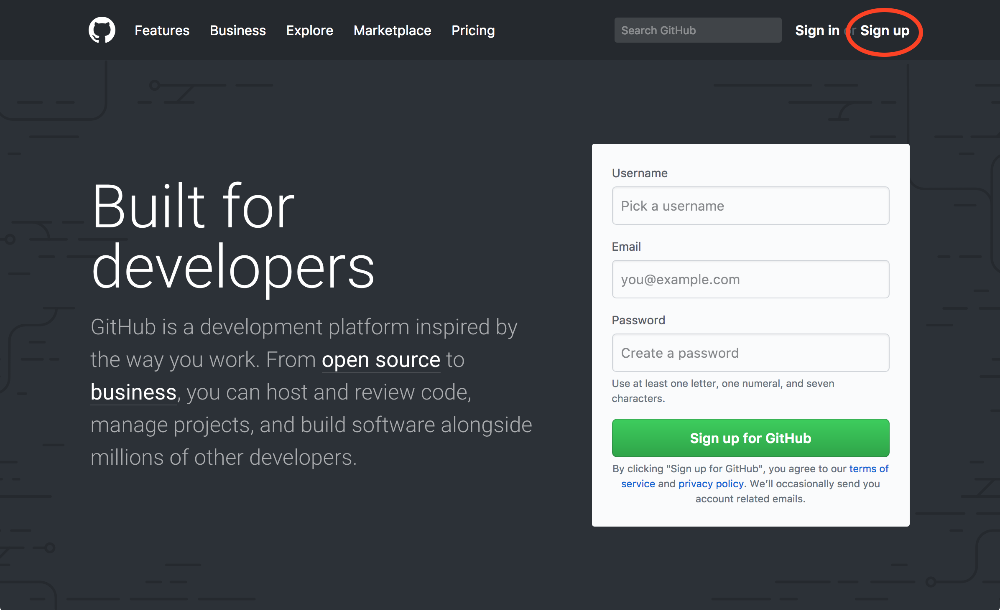
</div>

3. Create a username and give a valid e-mail account. Consider using an academic 
e-mail (you can use any account you prefer, but .edu accounts get special 
privileges). Create a password.

<div align='center'>
  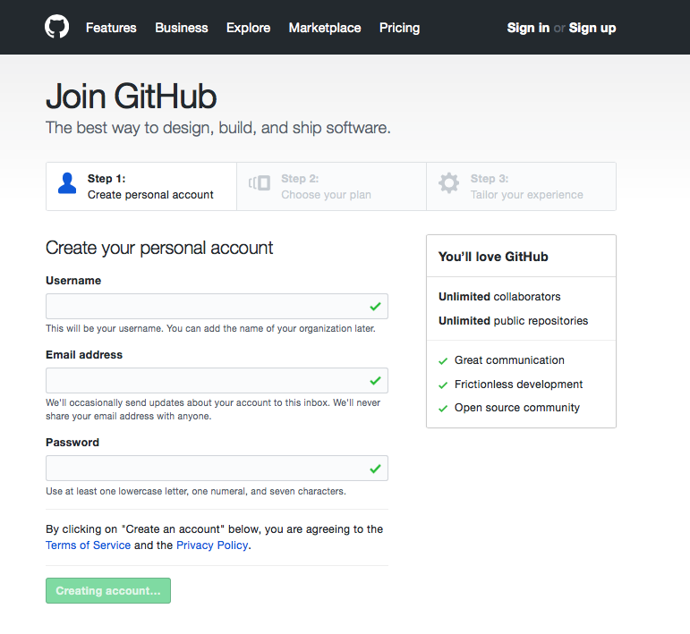
</div>

4. Select a plan (the unlimited, free one). 

<div align='center'>
  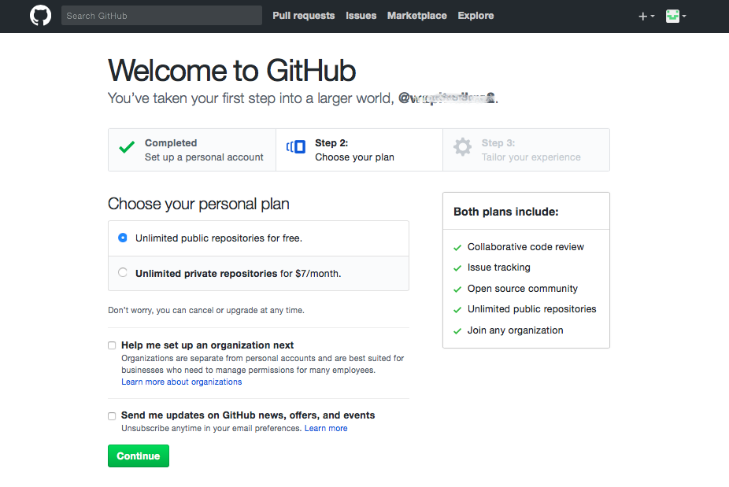
</div>

5. You might be asked to fill out a survey. Do this if you want to or "skip this 
step"

<div align='center'>
  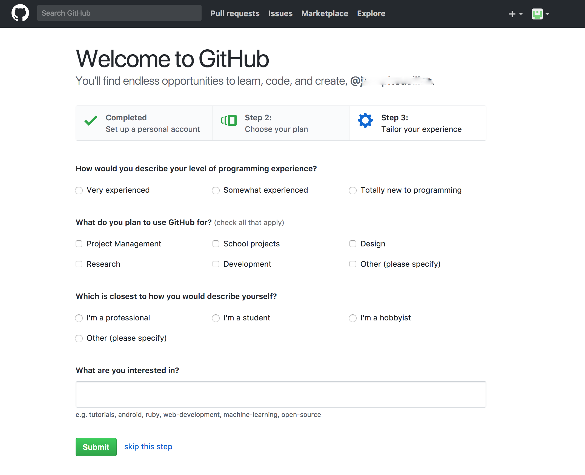
</div>

6. You will be prompted to either "Read the guide" or "Start a project". Select 
"Start a project". Don't forget to verify your email.

<div align='center'>
  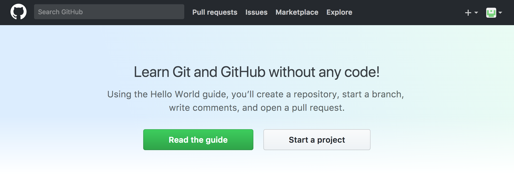
  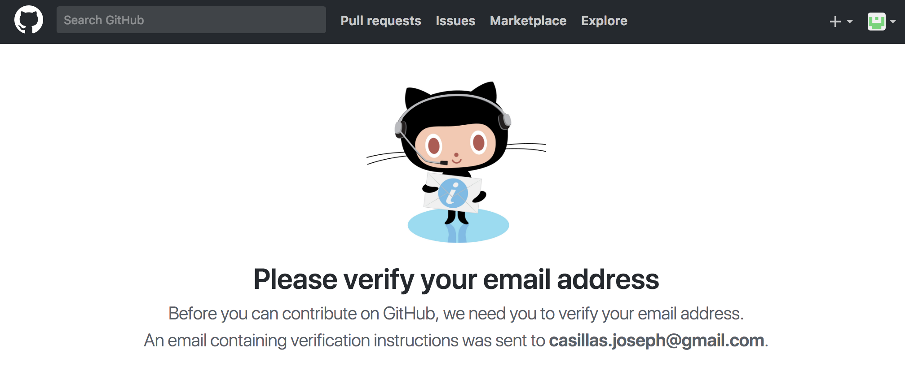
</div>

7. That's it. You now have a GitHub account. Before moving on to the next section you should download the [GitHub Desktop](www.desktop.github.com) application. 

<div align='center'>
  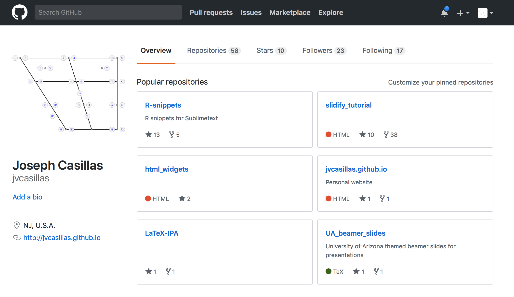
</div>

8. After downloading the desktop app, sign in to your account and install the command line tools. 

<div align='center'>
  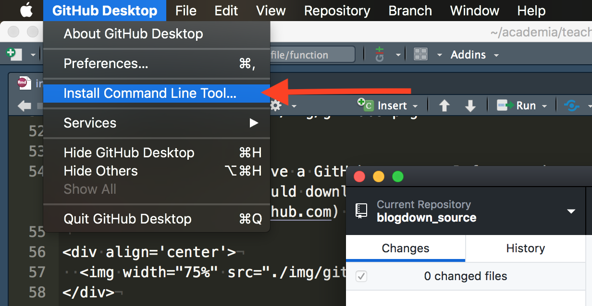
</div>

---

</br>


# Repositories 101

A repository, or ```repo```, is the equivalent of a project in GitHub 
terminology. A repo can contain folders (sub directories) and all sorts of 
files. In the first section you will learn how to ```fork``` a repo. Afterwards 
you are going to ```clone``` the repo to your personal computer, make some 
changes, ```commit``` those changes and then ```push``` them to your 
```branch``` of the repo so that they are saved (version controlled). Thus, the 
workflow is typically something like this:  

fork > clone > edit > commit/push  

Afterwards, you will learn how to submit a ```pull request``` so that those 
changes can be ```merged``` with the master repo (i.e. 
jvcasillas/datasci_assignments). 

This sounds confusing at first, but don't worry, I will explain the terminology 
in the upcoming sections. 

---

</br>


## Forking a repo

```Forking``` a repo is the data science equivalent of copying a repo from 
another GitHub user. You can fork a repo from the command line, but we will take 
a simpler approach and fork from the GitHub website. Note, this doesn't actually 
download anything on to your computer, but rather it adds the forked repo to 
your list of repos in your account. Specifically, we are going to fork the 
```datasci_assignments``` repo you will use to get your programming 
assignments for this course. 

---

**Note**: In order to complete the following steps you need to have the 
appropriate software. We will use the GitHub website, the GitHub desktop app, 
and, eventually, RStudio. This means you need to (1) have a GitHub account, (2) 
have the GitHub desktop app, and (3) have R/RStudio installed. If you have not 
done this yet, do so before continuing. 

---

1. Open your browser and sign in to your GitHub account. 

2. Use the search bar to find my ```datasci_assignments``` repo. You can search 
```jvcasillas/datasci_assignments```. If that doesn't work try this link: 
https://github.com/jvcasillas/datasci_assignments. You should be looking at 
something similar to this: 

<div align='center'>
  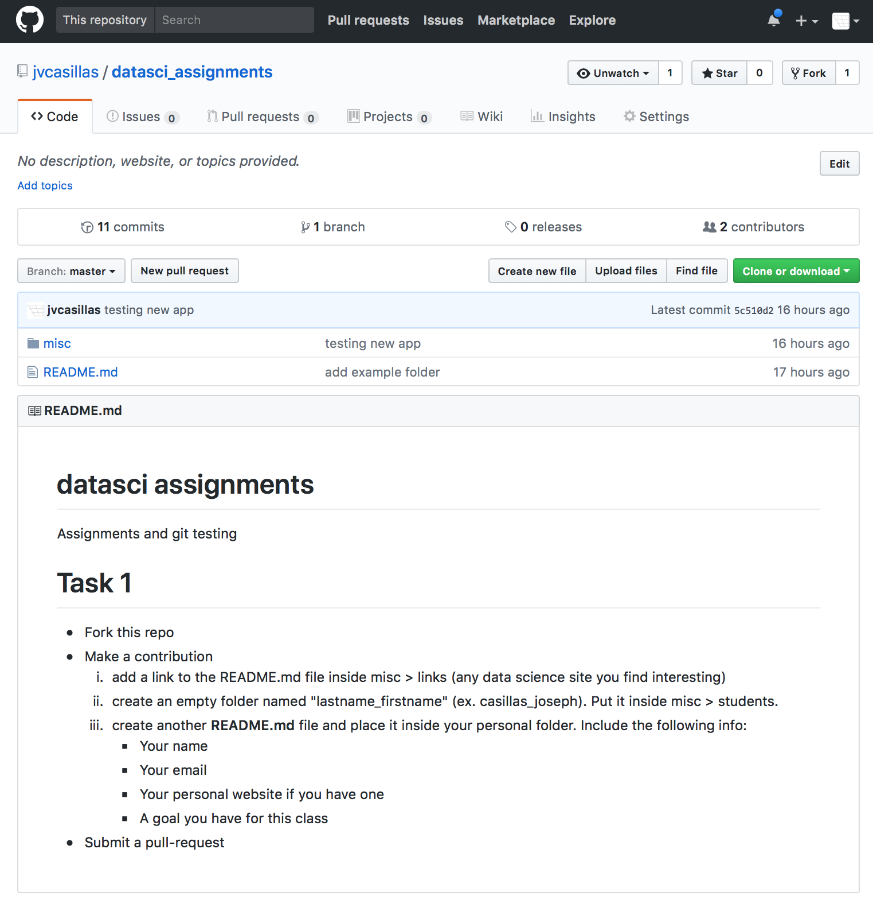
</div>

3. Click on the fork button (red rectangle). 

<div align='center'>
  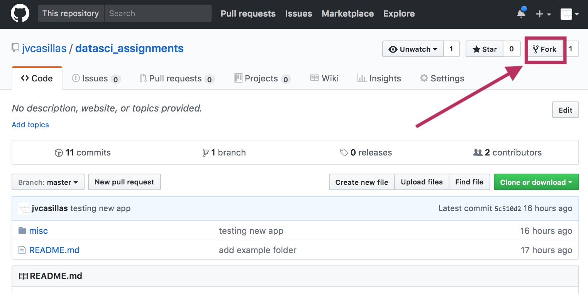
</div>

4. You have now ```forked``` this repo and you can find it among your personal 
repos. This process is very important to contributing to projects in data 
science. A large amount of important open source software is hosted on GitHub. 
For example, PsychoPy2 is an open source python library used to present stimuli 
in psychology and neuroscience experiments. You can find the repo 
[here](https://github.com/psychopy/psychopy). The programmers that contribute to 
this software fork the PsychoPy2 repo and edit the source code on their 
computers. Afterwards, they send the code back to main PsychoPy2 repo and it is 
integrated into the software, which is later distributed to the public to be 
downloaded and used. In the next section you will learn how this process works. 

---

</br>


## Cloning a repo

At this stage, we have already forked the repo. If you have not done this, go 
back to [Forking a repo](#forking-a-repo). In this section, and the 
those that follow, you are going to learn to do the rest of the workflow. 
Specifically, you are going to clone the ```datasci_assignments``` repo to your 
desktop and add a link to the README.md file inside ```misc > links```. You can 
add a link to any data science site/statistics/linguistics site you find 
interesting.

The term ```clone``` is pretty self explanatory. You are going to clone---make a 
copy of---the ```datasci_assignments``` fork on your personal computer. 

1. Open the GitHub desktop app. You might see a window asking you if you want to 
```Create a new repository```, ```Add a local repository```, or 
```Clone a repository```. If this is the case, select ```Clone a repository```. 
If you don't have this option, click ```File > Clone repository``` from the 
file menu. 

<div align='center'>
  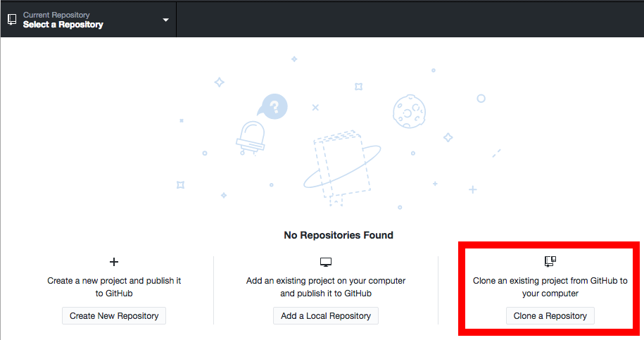  
  </br>
  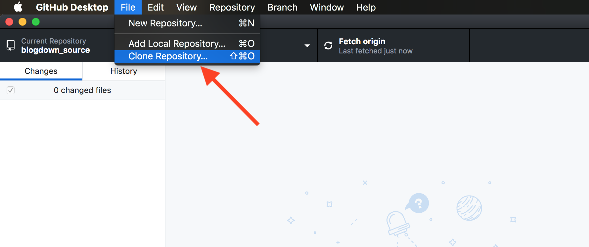
</div>

2. Now you will have a list of all of the repositories available in your GitHub 
account. At this point there should only be one, the ```datasci_assignments``` 
repo you just forked. Select the repo (green rectangle), choose where you want 
to clone it on your hard drive (green arrow, **NOTE** think about where you want 
to clone something before you do it... moving it later is a pain), and, finally, 
click the ```Clone``` button (blue arrow). 

<div align='center'>
  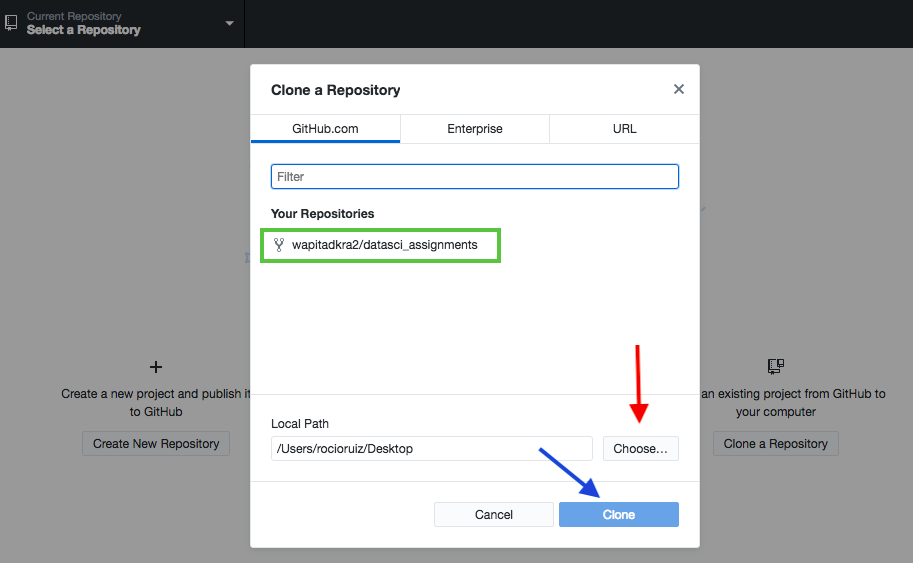
</div>

3. You will now see the cloned repo in your list of repos on the left-hand side. 

<div align='center'>
  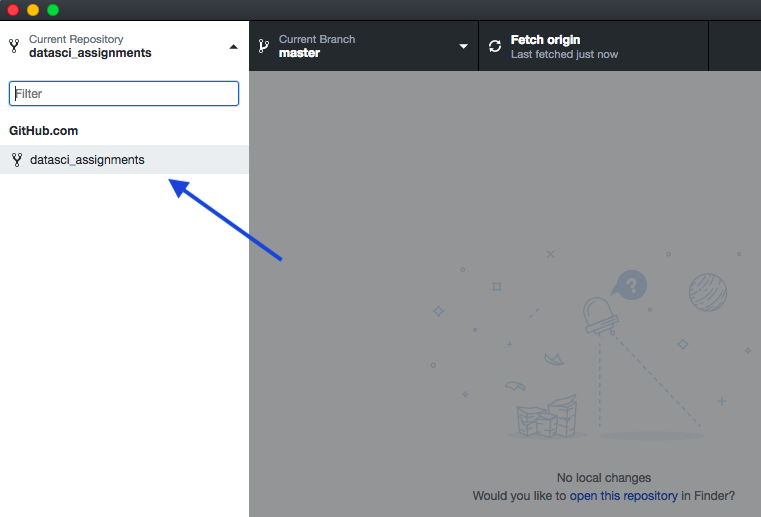
</div>

4. You should also find a copy of the folders/files of the repo wherever you 
choose to put the clone. 

<div align='center'>
  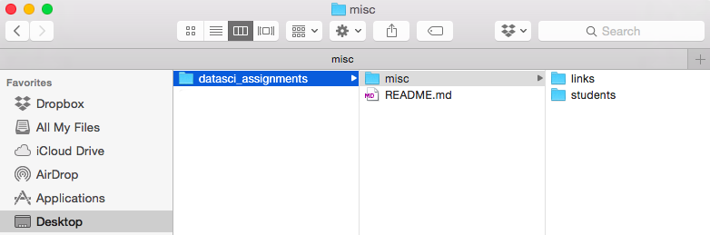
</div>

---

</br>


## Editing

There is not a whole lot to say in this section. You can edit the folders/files 
of the repo however you want, just as you would with your own personal project. 
**Note**: if you are working on a project that is shared by many (like this 
one), be careful about changing names of files/folders and moving them from 
their original place. It is certainly possible to do so, but it can cause 
problems for other users. Always follow proper naming conventions.

For the sake of completeness, here is an example of how I added a link. Follow 
these steps to add your own link.

1. Navigate to ```datasci_assignments > misc > links > README.md```

<div align='center'>
  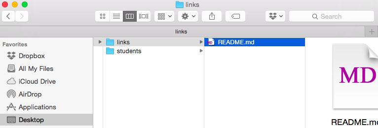
</div>

2. Open ```README.md``` in RStudio. Notice the format used to create the list 
and the link. Maintain this format. 

<div align='center'>
  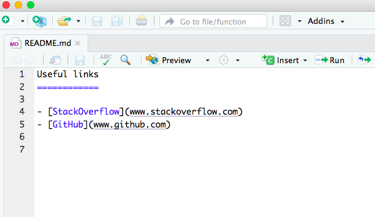
</div>

3. I added a link to the Rutgers website. You should add another link just below 
mine. 

<div align='center'>
  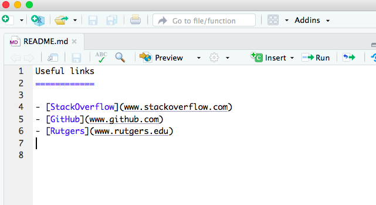
</div>

4. Save the file. 

---

</br>


## Committing and pushing changes

Whenever you make significant changes to your project you need to ```commit``` 
them. You can think of this as putting the relevant changes you made in a 
waiting room. You can then decide when to incorporate the changes (it doesn't 
have to be right away). The changes only exist on your system clone of the repo. 
Nobody else can see them, nor use them. In order to share your changes with 
others you need to ```commit``` the changes to your repo and ```push``` them to 
GitHub (online). Now we will ```commit``` the changes you made in the 
```README.md``` file inside ```links```. 

1. (Re)open the GitHub desktop app. You should see the files that were changed 
now appear in the left-hand column (blue arrow). Click this file.

<div align='center'>
  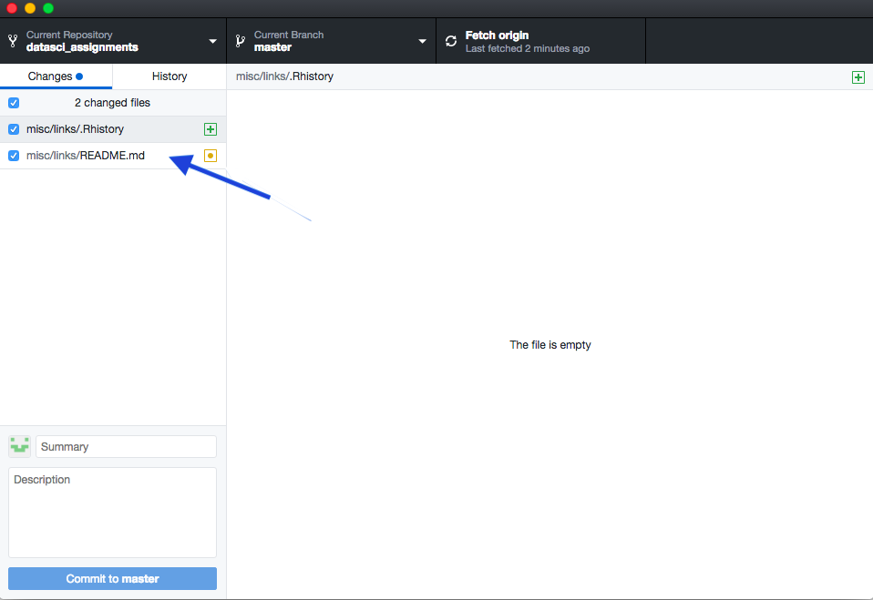
</div>

2. Notice that you now have a preview of the ```README.md``` file from the 
```links``` folder. The preview has the changes you made highlighted in green 
(blue arrow). It is a good idea to review your changes at this point to make 
sure that you did what you think you did. Next write a brief description of the 
changes you made where it says ```Summary``` (red arrow). The summary should 
remind future you what you did 3 months from now (in case you have to revert 
back to an old version of the repo). In this case, consider something like 
"Testing, added new links". Afterwards click ```Commit to master``` (green 
arrow). 

<div align='center'>
  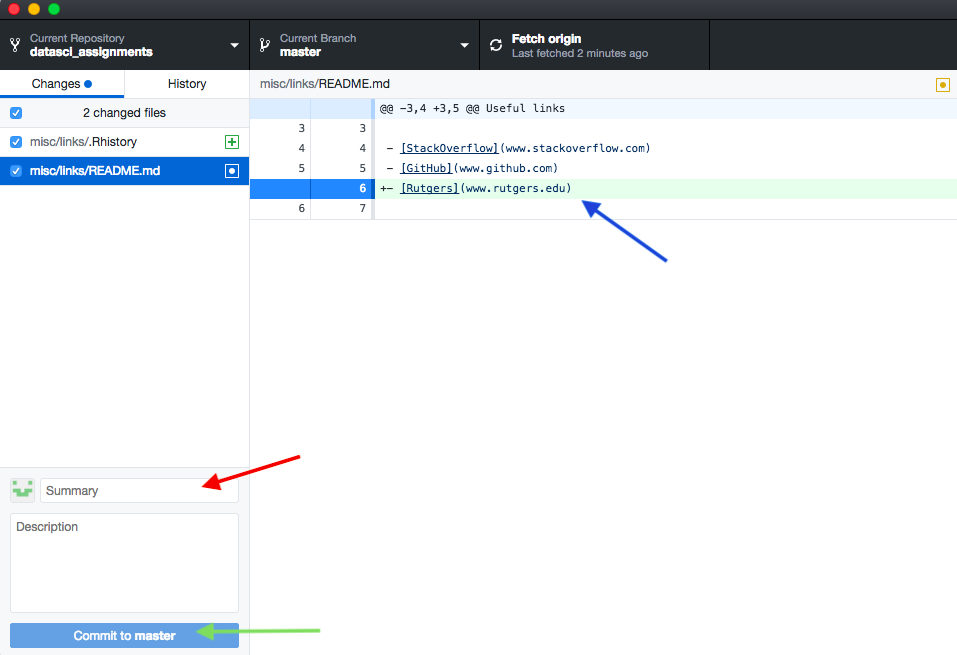
</div>

3. At this point the changes have been staged (i.e., they are in the waiting 
room). Now we will ```push``` them to your master branch of the repo (online). 
Click the ```Push origin``` button (orange rectangle). 

<div align='center'>
  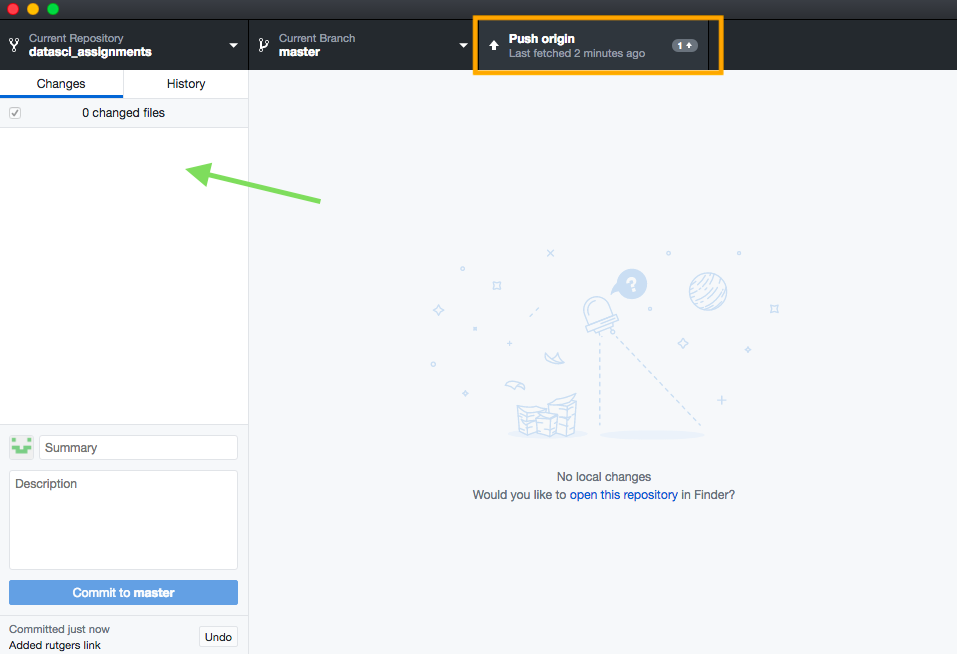
</div>

4. Now go back to your account on GitHub and look at the repo. Notice that your 
changes have been incorporated to *your* version of the repo (see blue 
rectangle). 

<div align='center'>
  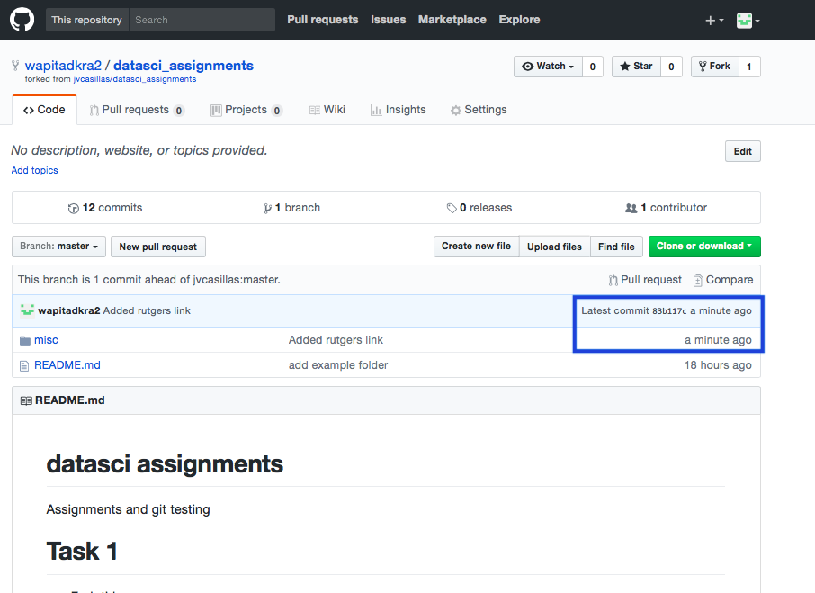
</div>

5. If you click on the ```misc``` folder, and then on the ```links``` folder, 
you will see the ```README.md``` file displayed in the web browser. **Note**: 
Now is probably a good time to mention that any file named ```README.md``` has a 
special status in GitHub. They are automatically converted to HTML and displayed 
in the repo page. It is always a good idea to include READMEs in your projects. 
You can use them to explain the details of your project, both for future you and 
other people who may fork it. 

<div align='center'>
  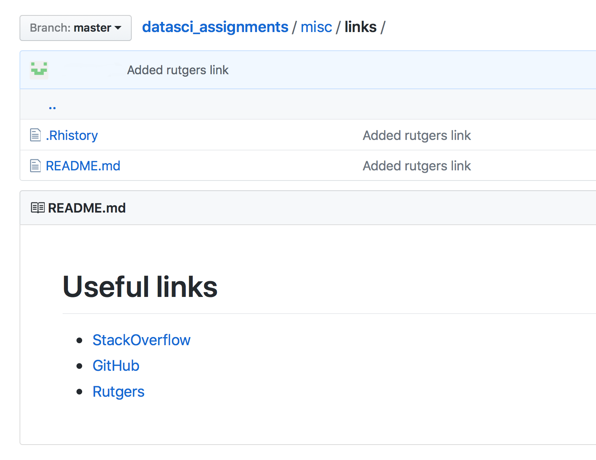
</div>

---

</br>


## Pull requests

### Submitting pull requests

Now that you have made edits to your repo, it is time to share your changes with 
the master branch. We do this by submitting a pull request. Think of this as 
sending a message to the owner of the repo (in this case me) in which all of 
your changes are displayed. The repo owner can then decide to merge your 
changes, reject them, or request that you make adjustments to them. You can 
think of this as a type of peer review in which the master repo owner is like 
the journal editor who decides if your changes are acceptable. 

So now we will walk through sending a pull request. We will do this from the 
GitHub website.

1. From your ```datasci_assignments``` repo on the GitHub website click the 
```New pull request``` button. 

<div align='center'>
  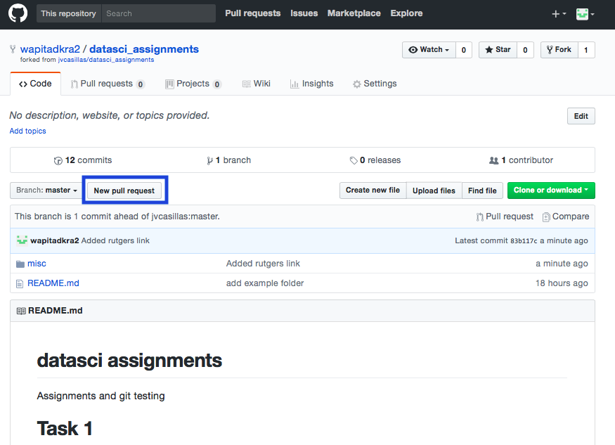
</div>

2. The next screen shows important information about your pull request and 
allows you to add some more description for the owner of the master repo. First, 
notice the request that you are making (blue arrows). This shows that you are 
requesting to merge from your version of the repo to the original version. 
Second, notice that the information we provided in our commit and push to the 
web is automatically used as the subject of the pull request (red arrow). If 
necessary, you can add more information here. Finally, click the 
```Create pull request``` button (green arrow) to submit the pull request. That's 
it. 

<div align='center'>
  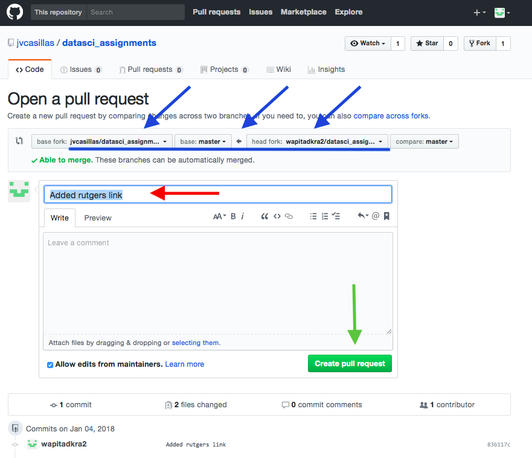
</div>

### Merging pull requests

- From the perspective of the owner of the main repo, this is what you see when 
you receive a pull request (i.e. this is what I will see when you submit your 
programming assignments). Notice the ```Pull requests``` tab (green circle). By 
clicking this tab I am sent to my list of pull requests.

<div align='center'>
  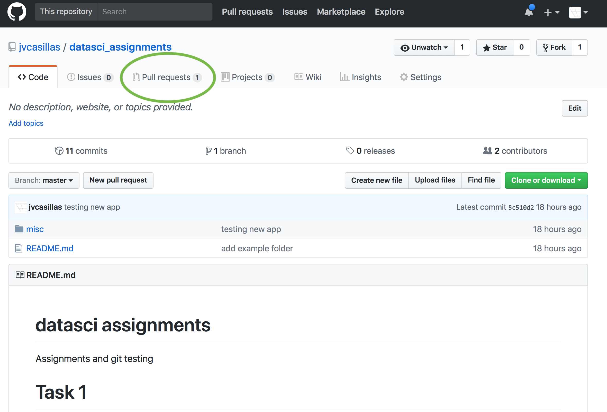
</div>

- This repo currently only has 1 pull request... the one we just made (green 
arrow). If we click on it...

<div align='center'>
  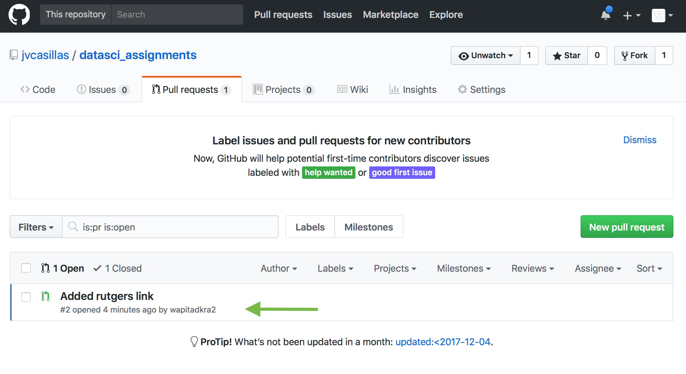
</div>

- We see the details of the pull request. Specifically, we can see how many files 
have been changed/added, and we can look at the details of the changes (blue 
arrows). 

<div align='center'>
  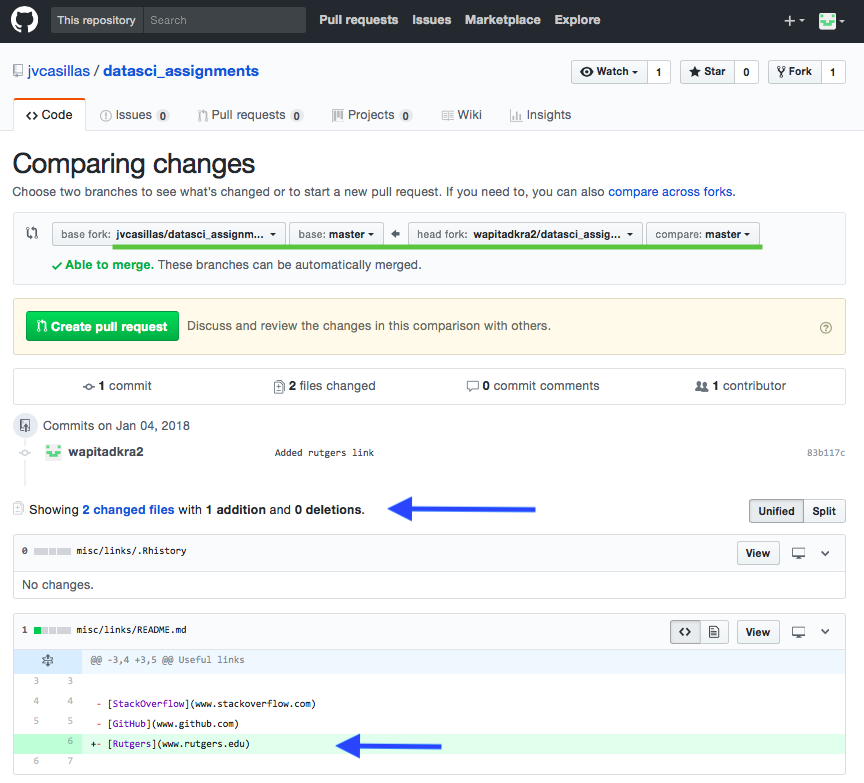
</div>

- Next, the owner of the repo can decide to accept the pull request, reject it, 
or leave a comment so that the submitter makes more changes. Notice that GitHub 
tells me if there are any conflicts. It is important that you do not submit or 
accept pull requests that will cause conflicts. I accept the request.

<div align='center'>
  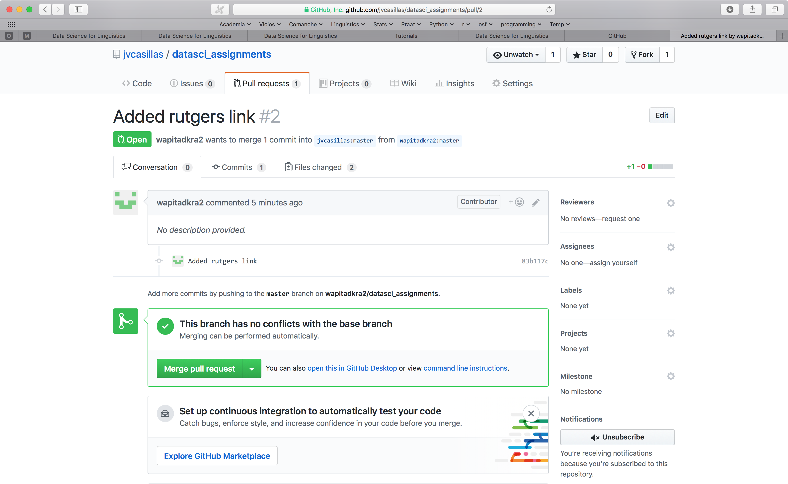
</div>

- I now can look at my updated version of the repo and see that the link change 
I just accepted has been incorporated into my version of the repo (see 
Rutgers link). 

<div align='center'>
  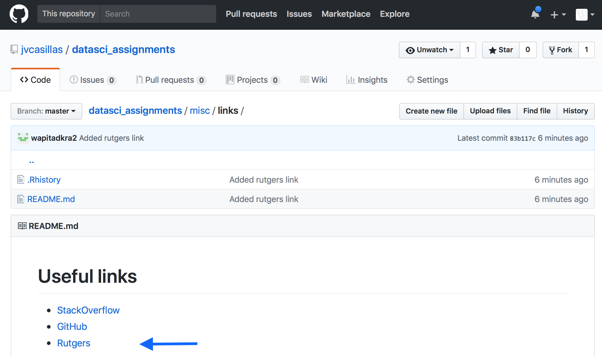
</div>

- Whenever you receive a pull request you also receive an email from GitHub with 
the details of the request. This means I will receive an email every time you 
submit your programming assignments. 

<div align='center'>
  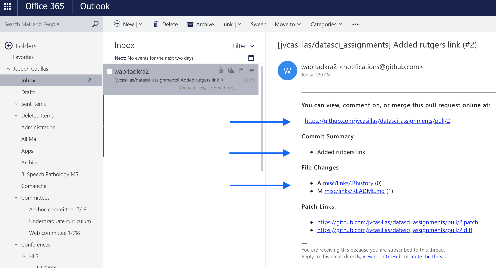
</div>

- I can also check the repo history using the GitHub desktop app and see the 
merge from the pull request is showing up (see red rectangle). Note, however, 
that my local version of the repo (i.e., the one I have on my personal computer) 
has not yet been updated. We will learn how to ```fetch``` upstream changes to 
our local repos in the next section. 

<div align='center'>
  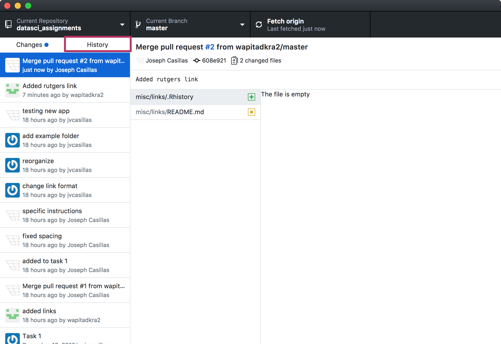
</div>

---

</br>


## Fetching changes

Summarizing what we have learned so far, GitHub is an online platform that allows 
us to version control our projects. The workflow we have outlined goes something 
like this: we can ```fork``` (i.e., copy) a ```repo``` from GitHub to have a 
personal copy of it in our GitHub account. Next, we ```clone``` (i.e., download) 
our copy to our personal computers so that we can ```edit``` our copy however 
we want. Once we are satisfied with our changes and want to save/include them 
in our version controlled repo online, we ```commit``` the changes and 
```push``` them upstream to our online version of the repo. If we want to share 
our changes with the original, "master" version of the repo, we can submit a 
```pull request``` to the owner. (S)he can ```merge``` the changes into the 
master version of the repo, and, in effect, implement our changes. From the user 
perspective this whole process is diagrammed something like this: 

```fork > clone > edit > commit/push > pull request```  

From the repo owner perspective: 

```receive pull request > review > merge```  

Now, you might be wondering: "What happens when the owner of the master repo 
makes a change after I have already forked, cloned, and edited my version?" That 
is a good question. Imagine you are working on a software project with a team of 
developers. Every time a new version of the software comes out you will need an 
up to date copy of the repo so that you can contribute. Or, more realistic for 
our uses, imagine that I update ```datasci_assigments``` with the newest 
programming assignment. How will you update your version to get the new 
assignment? The answer is simple: you have to ```fetch``` the most recent 
changes to the repo from **my** master version to **your** local copy. Here is 
how to do it. 

1. From the GitHub Desktop app, click ```Repository > Repository settings...```. 

<div align='center'>
  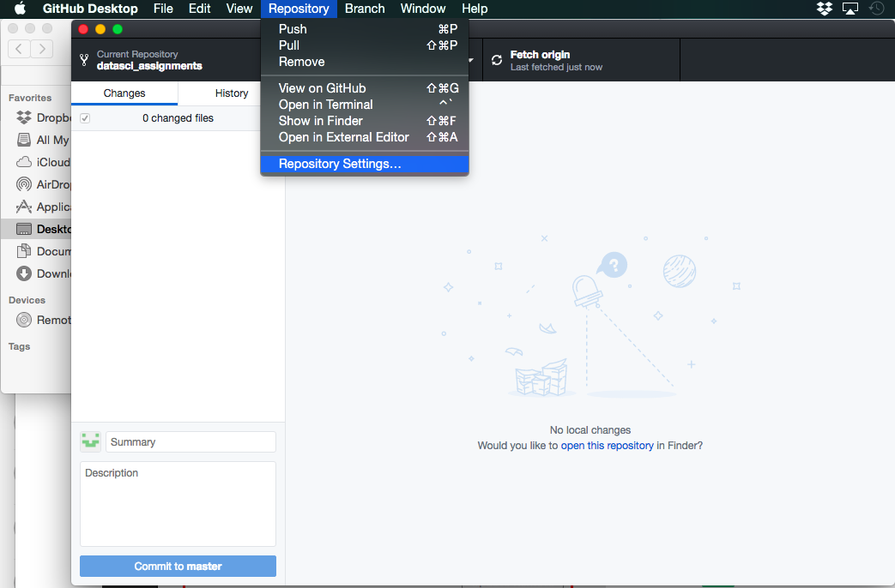
</div>

2. You will see the address of your cloned copy of the repo on the GitHub 
website. We will change this address to the version of the repo we want to 
fetch changes from. In this case, we want the direction of my version of the 
repo, so we change the username (highlighted in blue) from ```wapitadkra2``` 
(red arrow) to ```jvcasillas``` (green arrow). Note: I created the wapitadkra2 
account for the purposes of making this tutorial. Here you will see **your** 
username. After you have entered the address of the master version 
(```https://github.com/jvcasillas/datasci_assignments.git```), click ```Save```. 

<div align='center'>
  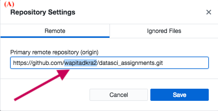
  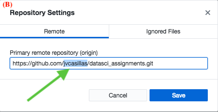
</div>

3. Now we are ready to fetch the changes from origin (essentially we just 
selected a different origin in step 2). Click the ```Fetch origin``` button 
(green rectangle). 

<div align='center'>
  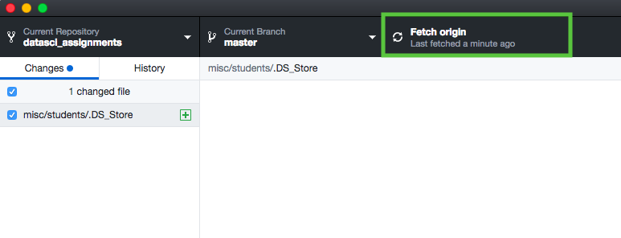
</div>

4. The application will check and see if your local copy is different from the 
origin. We can see here that there has been 1 change (next to the arrow pointing 
down). The button has changed. It now says ```Pull origin```. This means that if 
we click the button again, we will ```pull``` the changes from the origin to our 
local copy. Click ```Pull origin```. 

<div align='center'>
  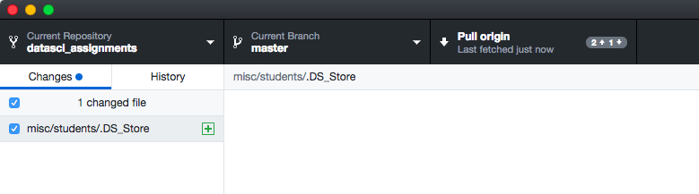
</div>

You now have the most up to date version of ```datasci_assignments```. You will 
need to update your repo whenever a new programming assignment is released. 
There is **one more thing** you need to do and this is important so pay 
attention. Make sure you **point your origin back to your GitHub repo** after 
you have fetched any changes. This means you need to do steps 1 and 2 again, but 
change from ```https://github.com/jvcasillas/datasci_assignments.git``` to 
```https://github.com/yourName/datasci_assignments.git```, where ```yourName``` 
is **your** GitHub username. That's it. 

---

</br>


## Summary

You now have a version controlled repo. If your computer dies, your project is 
saved and you still have access to it (if you have another computer). This is 
why I said GitHub is like dropbox for nerds. You might be wondering how/why 
this is better/different from dropbox, box, one drive, etc. Well, it really 
isn't all that much different (and it is initially much more difficult), but we 
will see some of the other benefits later on that really make it worth it (i.e., 
permanent rollback, easy collaboration, integration with R/RStudio, websites, 
etc.). 

---

</br>


# Creating projects

In this section we will cover several aspects of project management using repos. 
I suggest you make a repo of all of your projects. Remember, you can have as 
many repos as you want with your GitHub account and they can be set to private 
if you don't want to share the data/code with anybody (yet). First, you will 
learn how to create a repo. Next, you will learn how to make a project website 
for your repo. This can be used to create a personal academic website (see 
wwww.jvcasillas.com) or anything you want, really. After that, you will learn 
how you can publish your HTML RMarkdown presentations to the web (like this 
tutorial, for example). This is useful for creating presentations for your projects/conferences/classes, and later sharing them if you want. 

## Creating a repo

There are several different ways to create a repo. We will cover three: 
1) creating a repo from scratch from your computer, 2) creating a repo from 
scratch from the GitHub website, and 3) creating a repo from a project that 
already exists on your computer. 

### From scratch on your personal computer

1. Open the GitHub Desktop app. Click ```File > New Repository```. 

<div align='center'>
  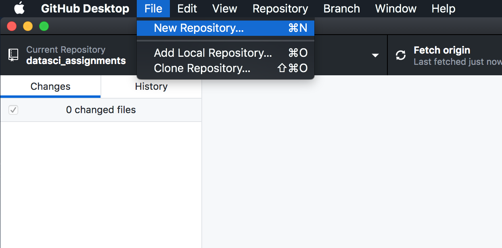
</div>

2. A new window will appear in which you can name the repo, add a description, 
choose the path indicating where the local repo will be created, include a 
README, along with some other options. I have decided to name this repo "test". 
The description says "test repo", and I have opted to create the repo on my 
desktop (Note: whenever you create a new repo I suggest you spend some time 
thinking about what you want to name it and where it will be located. You can 
change these options later, but it is more difficult than it should be). 
Finally, I initialized my test repo with a README (also a good idea to always do 
this) and clicked ```Create Repository```. 

<div align='center'>
  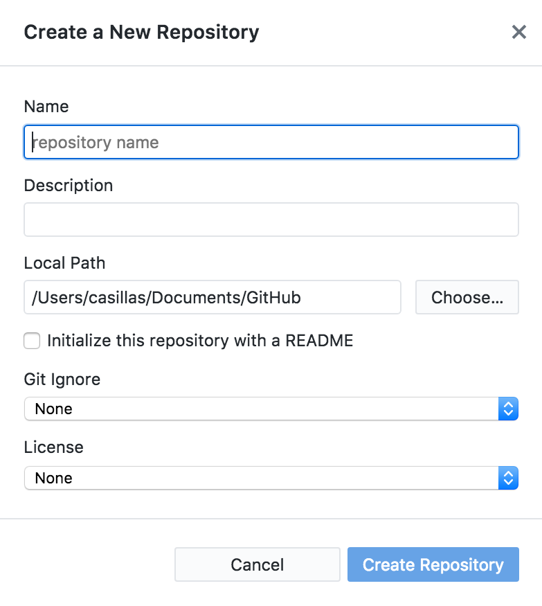
  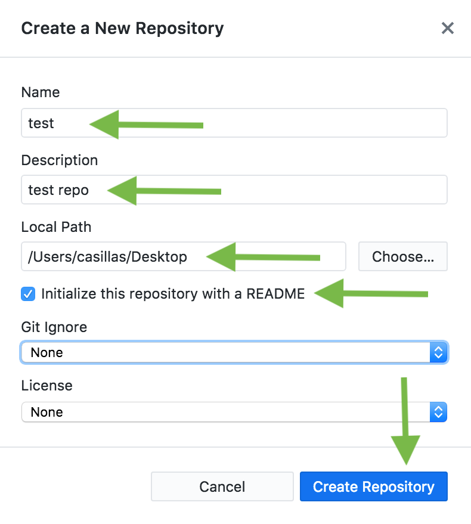
</div>

3. Just to make sure, I like to check and see that the repo was actually created 
with the name and path I selected. I can see that there is indeed a folder 
called ```test``` on my desktop. 

<div align='center'>
  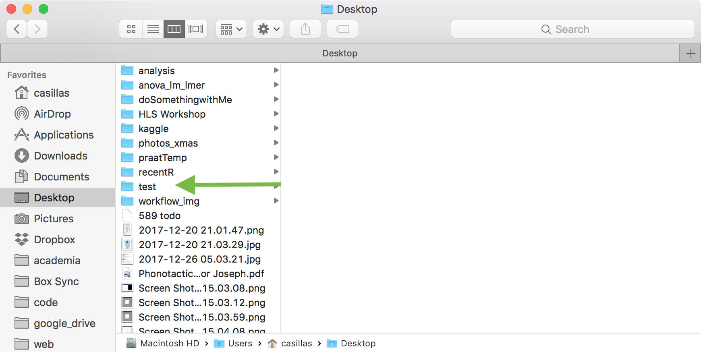
</div>

4. If I click the ```Current Repository``` button inside the GitHub Desktop app 
I can see that the ```test``` repo is listed under "other", as opposed to 
GitHub.com (see green arrow). This is because I have not yet published the repo 
to the web. That is, at this point the repo only exists on my computer. To 
publish the repo to GitHub.com we have to click ```Publish repository``` 
(yellow rectangle). Do this now.

<div align='center'>
  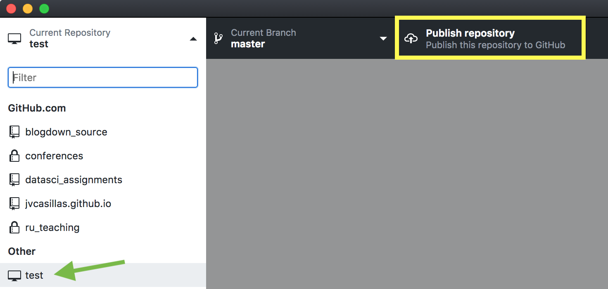
</div>

5. A new window appears. The information we included previously is automatically 
included. At this point we can also opt to keep the code private if we want. You 
can always change this later if you want. Click ```Publish Repository``` and 
check your account at GitHub.com to see your new repo. 

<div align='center'>
  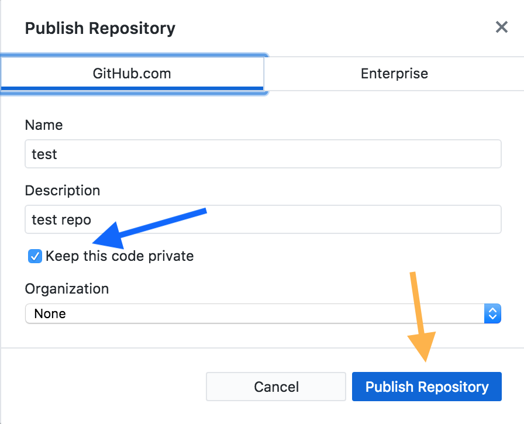
</div>

That's it. 

### From the web

Though I find that I do this much less often, it is also possible to create a 
repo directly from GitHub.com. 

1. Open your web browser to www.github.com and sign in to your account. 
2. From the main page or your personal profile, click the green button (it says 
```New repository``` or ```New``` depending on where you are, see orange arrows). 

<div align='center'>
  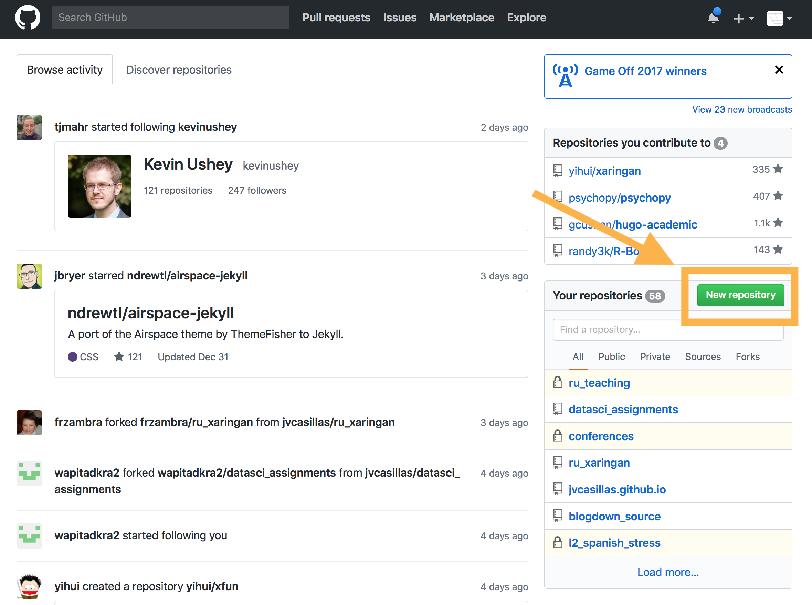
  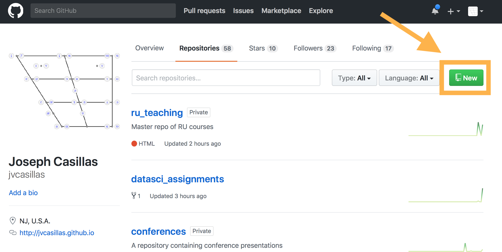
</div>

3. A new window will appear in which you can select the name of the repo, add a 
description, etc. Do this and click ```Create repository```.

<div align='center'>
  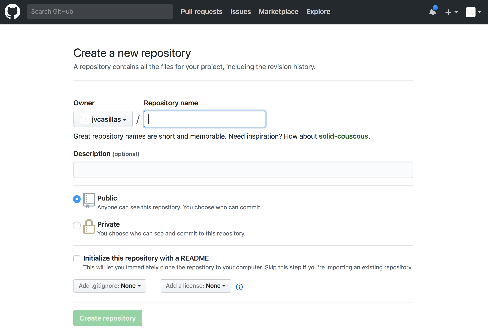
  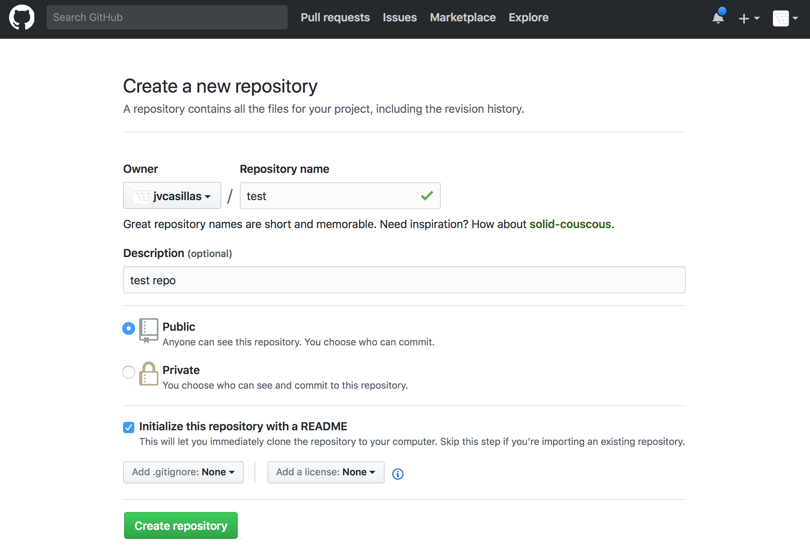
</div>

4. That's it. You should now see your new repo. Remember, at this point the repo 
only exists online. You need to clone it using the GitHub desktop app in order 
to have a local copy on your computer.

<div align='center'>
  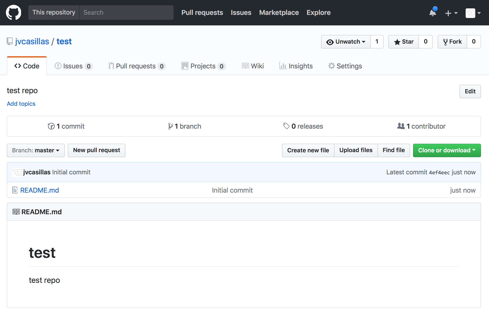
</div>


### From an existing project

If you already have a project on your computer you can add it the GitHub 
desktop app and publish it to GitHub.com. 

1. Open GitHub desktop and click ```File > Add Local Repository```

<div align='center'>
  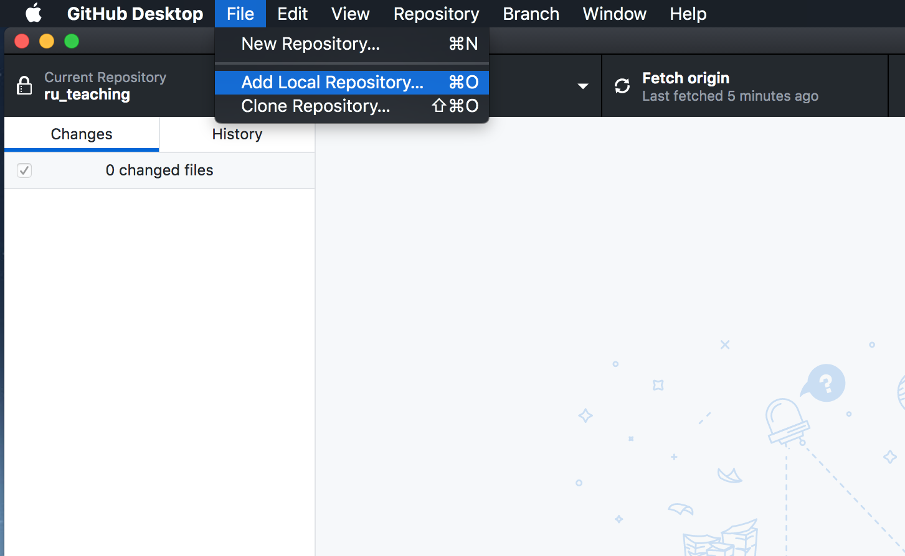
</div>

2. A new window appears in which you can select the project folder. Do this and 
click ```Add Repository```. 

<div align='center'>
  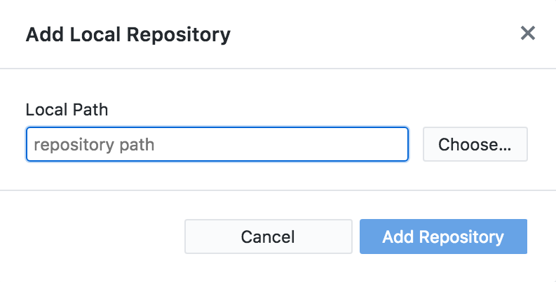
</div>

Note: if you added a folder that was not a GitHub project you will be asked if 
you would like to make it a GitHub project. Say yes and you're done. 

## Creating a website

Coming soon.

## Sharing an HTML5 presentation 

Coming soon. 
